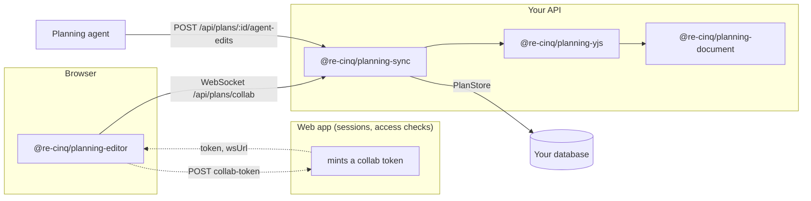
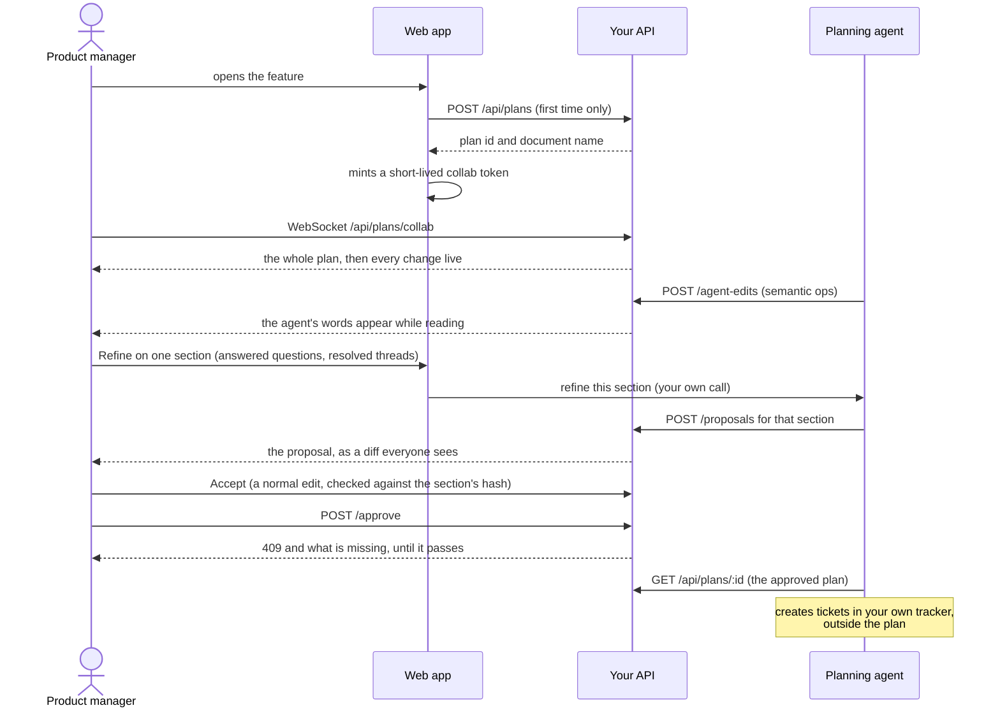
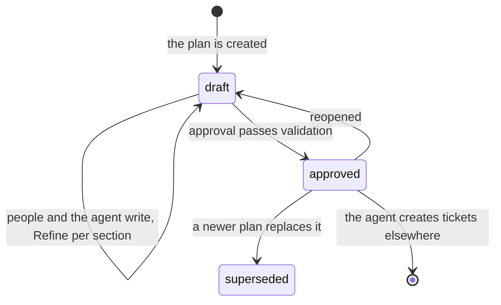

# planning-station

The plan as a living, collaborative document. A plan is written together by
product people and the planning agent in a fixed template, versioned, and
approved. Approval is where the plan ends: tickets, runs and their failures are
built from the approved plan by your own systems and live there.

Decisions: [ADR-001](adrs/ADR-001-packages-and-ports.md),
[ADR-002](adrs/ADR-002-yjs-is-truth-json-is-projection.md).

## Which package does my service install?

| Your service                                | Install                                                      | Why                                                              |
| ------------------------------------------- | ------------------------------------------------------------ | ---------------------------------------------------------------- |
| **Web app** (React page where people write) | `planning-editor` (+ `planning-document` for its types)      | renders the plan, speaks a transport you supply                  |
| **API** (hosts the plan, owns the database) | `planning-sync` (+ `planning-document`)                      | REST routes, the collaboration socket, versions, approval gate   |
| **Agent / MCP tools** (writes plans)        | `planning-document`, and `planning-yjs` only if it edits Yjs | builds ops, reads the projection; normally it just calls the API |
| **Anything that only reads plan JSON**      | `planning-document`                                          | schemas, templates, validation, diffs                            |

Rule of thumb: **one service hosts plans** and installs `planning-sync`;
**one frontend** installs `planning-editor`; everyone else that touches a plan
installs `planning-document` and talks to the API over HTTP.



`planning-yjs` is rarely installed directly: `planning-sync` and
`planning-editor` both depend on it. You need it by name only when you host the
live document yourself, or when an agent edits a document outside your API.

## Packages

| Package                                                    | Runs in         | Status | What it is                                                                                                                        |
| ---------------------------------------------------------- | --------------- | ------ | --------------------------------------------------------------------------------------------------------------------------------- |
| [`@re-cinq/planning-document`](packages/planning-document) | Node + browser  | 0.2.0  | The JSON contract: block schemas, templates per plan type, `toPlanDocument` / `toBlocks`, `validatePlan`, agent ops, diffs        |
| [`@re-cinq/planning-yjs`](packages/planning-yjs)           | Node (+browser) | 0.2.0  | Yjs bridge: headless schema, `seedDoc` / `readBlocks`, `applyOpsToDoc`, base64 wire helpers                                       |
| [`@re-cinq/planning-editor`](packages/planning-editor)     | Browser (React) | 0.2.0  | Collaborative `PlanEditor` on BlockNote + Yjs over a `PlanTransport`: presence, live cursors, guarded sections, `/` menu, outline |
| [`@re-cinq/planning-sync`](packages/planning-sync)         | Node (server)   | 0.2.0  | The server side: `PlanStore` port, in-memory store, plan service with versions and approval, collaboration server, hapi adapter   |

Each package's README opens with a step-by-step integration tutorial for exactly
that side: [contract](packages/planning-document/README.md),
[Yjs bridge](packages/planning-yjs/README.md),
[editor](packages/planning-editor/README.md),
[server](packages/planning-sync/README.md).

## Integrating it into an existing product

The walkthrough below assumes the usual shape: a web app people log into, an API
with a database, and an agent that drafts plans and, once a plan is approved,
turns it into work. Each step says which side does it, and links to the package
that owns the detail.



### 1. The API hosts plans — one migration, one port, one call

**Where:** your API service. **Installs:** `@re-cinq/planning-sync`.

Add the tables (`plans`, `plan_state`, `plan_versions`), implement `PlanStore`
against them, and prove the implementation before trusting it:

```ts
import { checkPlanStore } from "@re-cinq/planning-sync/testing";

expect(await checkPlanStore(postgresPlanStore(testPool))).toEqual([]); // no failures
```

Then register the library on the server you already run:

```ts
registerPlanningSync(server, {
  store: postgresPlanStore(pool),
  authenticator, // step 3
  serviceAuth: (request) => hasBearerScope(request, "plans:write"),
});
```

That one call adds `/api/plans/*` **and** the WebSocket upgrade at
`/api/plans/collab` to the same process and the same port. No new deployment.
Details: [server tutorial](packages/planning-sync/README.md#tutorial-plans-in-your-own-api-from-nothing).

### 2. Point your own records at their plan

**Where:** your API. A plan is a document, not a replacement for your domain
model. Keep your feature or issue row and give it a `plan_id`:

```sql
ALTER TABLE features ADD COLUMN plan_id uuid REFERENCES plans (id);
```

Create the plan the first time someone opens it, and store the id:

```ts
const { meta } = await service.createPlan({
  repo: feature.repo,
  title: feature.title,
  type: "feature", // or ui-change, performance, refactor, incident-response
  createdBy: user.id,
});
await features.setPlanId(feature.id, meta.id);
```

Seed it from whatever you already know — an existing description, a previous
analysis — by sending agent ops right after creating it (step 5).

### 3. Decide who may open a plan

**Where:** your web tier mints, your API verifies.

The browser connects straight to the API's socket, so it carries a short-lived
token. Your web tier already knows the session: check it, check the user's access
to the repo, and mint a token scoped to one plan.

```ts
// web tier: POST /plans/:id/collab-token
if (!session) return unauthorized();
if (!(await userCanAccessRepo(session, repo))) return forbidden();

return { token: await mintCollabToken(session, planId), wsUrl, documentName };
```

```ts
// API: the CollabAuthenticator the library asks
authenticate: async (token, { repo, planId }) => {
  const claims = await verifyToken(token);
  if (claims.plan !== planId || claims.repo !== repo) return null;

  return { id: claims.sub, name: claims.name, role: claims.role };
};
```

The library verifies nothing itself: identity stays yours. A `read` role, or an
approved plan, connects read-only.

### 4. The plan page

**Where:** your web app. **Installs:** `@re-cinq/planning-editor`.

Import `@re-cinq/planning-editor/style.css` once in your root layout, then render
the editor in a client component that builds a transport from the token in step 3
and destroys it on unmount. Two people on the page see each other's words,
cursors and section.

The page shows the feature name as an editable H1 (renaming it renames the
plan), then one H2 per template section. Under each heading sit the agent's
questions with suggested answers, the comments, and a **Refine** button that
asks for that one section only. Refine works from what is settled — answered
questions and resolved threads — and the agent's answer comes back as a
proposal that someone accepts, because people may still be writing there. Wire
the callbacks your workflow needs:

```tsx
<PlanEditor
  transport={transport}
  user={user}
  validationPhase="approval"
  onValidation={(report) => setCanApprove(report.passed)}
  onRefine={(request) => askAgentToRefine(planId, request)} // resolves once the agent has it
/>;

<button disabled={!canApprove} onClick={() => approve(planId)}>
  Approve
</button>;
```

Details: [editor tutorial](packages/planning-editor/README.md#tutorial-a-plan-page-in-a-nextjs-app).

### 5. The agent drafts, instead of writing a document nobody can edit

**Where:** your agent, or the tool layer it calls. **Installs:** nothing, if it
goes through the API; `@re-cinq/planning-document` if you want the op types.

```http
POST /api/plans/:id/agent-edits
{ "actor": "planning-agent", "ops": [ … ] }
```

The ops are semantic and keyed by id (`set-section-text`, `append-to-section`,
`upsert-kpi`, `set-prototype`), so a second pass **revises** the plan instead
of replacing it, and lands in the live document while people are reading it.
Give the agent `GET /api/plans/:id` to read the current plan first, and it can
answer questions people left in the plan rather than starting over.

A Refine from step 4 is answered differently: the request carries the section's
settled inputs, the ids they have, and the section's hash, and the agent posts
its ops as a proposal for that one section:

```http
POST /api/plans/:id/proposals
{ "actor": "planning-agent", "slot": "scope", "baseHash": "…",
  "ops": [ … ], "uses": { "questions": ["q-tax"], "comments": ["c1"] } }
```

Everyone sees it as a diff under the section. Accepting writes it and marks the
questions and threads it used, so the next Refine does not write them in again;
if the section changed after the ask, it can only be asked for again. An agent
that writes directly can send the same guard: `base: { slot, hash }` on
`agent-edits` answers 409 `section-changed` instead of overwriting someone.

### 6. Approval ends the plan

**Where:** your API and your workflow.

`POST /api/plans/:id/approve` runs `validatePlan(plan, "approval")` first and
answers 409 with everything still missing, so the button in step 4 is never the
only gate. An approved plan is read-only for people until someone reopens it.

What happens next is yours. Typically the agent reads the approved plan with
`GET /api/plans/:id`, breaks it into tickets in your tracker, and the work, its
runs and its failures live there. Hook that "start the work" action to the same
condition:

```ts
enforceTrue(
  plan.status === "approved",
  NotReady,
  "the plan is not approved yet",
);
```

### 7. Before you ship

- **WebSocket timeouts:** your ingress must keep idle connections open well past
  60 s, or people's sockets drop mid-sentence.
- **Graceful shutdown:** allow 30 s or more to stop, so pending writes flush.
- **One `yjs`:** dedupe it in the browser bundle; two copies fail silently.
- **Secrets:** the token secret must be shared by the web tier that mints and the
  API that verifies, and nothing else.
- **Retention:** every content change cuts a version. Prune the automatic ones on
  a schedule if your plans are long-lived.

### What you do not have to build

Presence and cursors, the section guard, questions with suggested answers,
comments, per-section Refine, the slash menu, validation per phase, versioning
and diffs. They come with the packages, and each one is pinned to a test in
[specs/](specs).

## Using the contract

```ts
import {
  seedBlocks,
  templateFor,
  toPlanDocument,
  validatePlan,
} from "@re-cinq/planning-document";

const plan = toPlanDocument(seedBlocks(templateFor("performance")), meta);
validatePlan(plan, "approval").problems;
// [{ code: "empty-required-section", slot: "intent", ... }, ...]
```

The guarantees are in the [contract spec](specs/planning-document/spec.md).
Plan types: `feature`, `ui-change`, `performance`, `refactor`,
`incident-response`. Validation phases: `draft` (structure) and `approval`
(required content, KPIs, prototype maturity).

## Using the editor

```tsx
import { PlanEditor, type PlanTransport } from "@re-cinq/planning-editor";
import "@re-cinq/planning-editor/style.css";

const transport: PlanTransport = {
  send: (event) => socket.send(JSON.stringify(event)), // "update" | "awareness"
  subscribe: (handler) => socket.onEvent(handler), // "document" first, then updates
};

<PlanEditor
  transport={transport}
  user={{ id: "ana", name: "Ana", color: "#d33682" }}
  onChange={savePlan}
  validationPhase="approval"
  onValidation={(report) => setCanApprove(report.passed)}
  adapters={{ renderMockup: (mockup) => <SandboxedMockup {...mockup} /> }}
/>;
```

The editor knows nothing about the network. The host's transport delivers the
whole plan as one `document` event (plan meta plus the base64 Yjs state), then
remote `update` and `awareness` events; the editor sends every local edit and
cursor move straight back. Everyone else on the plan appears in the presence bar
with the section they are in, and their cursors are drawn in their colour.
`createMemoryHub({ meta, blocks })` gives in-page peers a shared plan without a
server, which is what the tests and the playground use.

People type `/` to add a block; the menu offers only what the current section
allows, and an answer attaches to the question above it. The outline beside
the document lists what the plan still needs for the chosen phase
(`showOutline={false}` hides it). Mockups are never rendered as raw markup: pass
`renderMockup` to show them in your own sandbox. The behaviour is in the
[editor spec](specs/planning-editor/spec.md).

Everything it draws is SCSS compiled into one stylesheet, and every value is a
token that reads the host's design token first: `--text`, `--text-muted`,
`--bg-surface`, `--bg-hover`, `--border`, `--accent`, `--danger`, `--font-sans`,
`--fs-sm`, `--space-3`, `--radius-sm`, `--shadow`, `--transition`, with a
fallback for each. Flip your theme, or `data-color-scheme="dark"`, and the
editor follows — native form controls included. Override a single value on
`.ps-editor` when you want the editor to differ from the rest of the page; the
[theming section](packages/planning-editor/README.md#theming) has the full list.
Host tests without a browser can render `PlanEditorStub` from
`@re-cinq/planning-editor/testing`.

## Hosting the server side

```ts
import { registerPlanningSync } from "@re-cinq/planning-sync/hapi";
import { createMemoryPlanStore } from "@re-cinq/planning-sync/memory";

const { service } = registerPlanningSync(server, {
  store: createMemoryPlanStore(), // in production, your own Postgres store
  authenticator, // the host decides who may open a plan
  serviceAuth: (request) => hasBearerScope(request),
});
```

This mounts `POST /api/plans`, `GET /api/plans/:id`, its versions, `approve`,
`reopen` and `agent-edits`, plus the WebSocket upgrade at
`/api/plans/collab`, on the host's own listener. Every document write becomes
the plan's next version when its content changed; approval runs `validatePlan`
at the approval phase first and answers RFC 9457 problem details when the plan
is not ready. Persistence is the host's: implement `PlanStore` and check it with
`checkPlanStore` from `@re-cinq/planning-sync/testing`, which also ships
`startTestServer`. The guarantees are in the
[sync spec](specs/planning-sync/spec.md).

## How the agent writes

The planning agent never rewrites a plan wholesale. It sends id-stable ops
(`set-section-text`, `append-to-section`, `upsert-kpi`, `set-prototype`) to
`POST /api/plans/:id/agent-edits`, and the library applies them to the **live**
document, replacing only the blocks that changed, so the people reading it see
the change arrive and keep their cursors.

A plan lives from draft to approval. Tickets are not part of it: once the plan
is approved, the agent reads it and creates them in your own system.



## Development

```sh
npm install
npx playwright install chromium   # once, for the editor's browser tests
npm test            # vitest: the contract in Node, the editor in Chromium
npm run typecheck
npm run lint        # every re-lint rule, as errors
npm run build
npm run poc         # plan server on :1234, playground on http://localhost:5173
```

`npm run poc` starts both halves of the proof of concept: a hapi server on
port 1234 running `@re-cinq/planning-sync` with the in-memory store, and the web
playground on 5173, which opens a sample "Faster checkout" feature plan.

The page is one person's view, as a real plan page would be. Each tab picks a
name of its own, so **open a second tab or another browser** to be someone else:
type in one and the words, the cursor and the presence entry appear in the other.
Add `?as=ben` to choose who you are.

"The agent writes" sends a set of agent ops, and each section's Refine asks the
fake agent to rework just that section; "What changed in the last
version" renders the diff between the last two versions, and the plan JSON is
underneath. Nothing is stored: restart the server and the plan is new again, by
design. The web half loads the packages from source, so edits to them reload the
page.

Linting runs all 40 rules of
[`@re-cinq/eslint-plugin-re-lint`](https://github.com/re-cinq/re-lint) as
errors, on top of its `recommended` preset. Three of them shape how you work
here:

- `require-spec-link`: every test is linked from a statement in
  [`specs/`](specs) or [`adrs/`](adrs) with an inline
  `([validated by](path/to/file.test.ts#L12))`. Add the link when you add the
  test; move it when the test's line moves.
- `no-cross-layer-import`: [`layers.yaml`](layers.yaml) lists what each folder
  may import.
- `no-forbidden-imports`: each package keeps the dependency envelope from
  ADR-001. The contract never imports React, Yjs, BlockNote, Hocuspocus or hapi.
