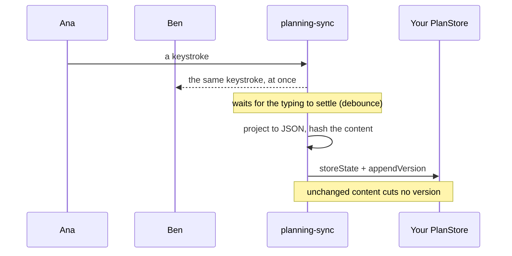

# @re-cinq/planning-sync

The plan's server side, as a library you register inside your own hapi process:
plan routes, the collaboration socket, versions on every write, agent edits and
the approval gate. Persistence is yours, behind one port. A plan ends at
approval; tickets built from it live in your own system.

```sh
npm install @re-cinq/planning-sync yjs
```

|               |                                                                          |
| ------------- | ------------------------------------------------------------------------ |
| Runs in       | **Node, inside your API process**. No separate service, no separate port |
| Installed by  | the one service that hosts plans and owns the database                   |
| Serves        | browsers running `@re-cinq/planning-editor`, plus your agent over HTTP   |
| Never imports | React or any editor code                                                 |

Not sure which package you need? See
[which package does my service install?](../../README.md#which-package-does-my-service-install)

`@hapi/hapi` is an optional peer dependency, needed only for the `./hapi`
subpath. Full guarantees, with the test behind each one:
[sync spec](../../specs/planning-sync/spec.md). Why it is a library and not a
service: [ADR-001](../../adrs/ADR-001-packages-and-ports.md).

## Tutorial: plans in your own API, from nothing

Six steps. At the end, two browsers edit one plan through your service, and the
plan survives a restart.

### 1. Install

```sh
npm install @re-cinq/planning-sync @re-cinq/planning-document yjs
```

### 2. Give the plans somewhere to live

The library never touches your database; it asks your store. On Postgres, three
tables are enough:

```sql
CREATE TABLE plans (
  id uuid PRIMARY KEY,
  repo text NOT NULL,
  title text NOT NULL,
  type text NOT NULL,
  status text NOT NULL,
  approval jsonb,
  current_version int NOT NULL DEFAULT 0,
  created_by text NOT NULL,
  created_at timestamptz NOT NULL DEFAULT now(),
  updated_at timestamptz NOT NULL DEFAULT now()
);

CREATE TABLE plan_state (
  plan_id uuid PRIMARY KEY REFERENCES plans (id),
  state bytea NOT NULL, -- the Yjs document
  json jsonb NOT NULL, -- the projection your API answers
  content_hash text NOT NULL,
  updated_at timestamptz NOT NULL DEFAULT now()
);

CREATE TABLE plan_versions (
  plan_id uuid NOT NULL REFERENCES plans (id),
  version int NOT NULL,
  reason text NOT NULL,
  created_by text NOT NULL,
  created_at timestamptz NOT NULL,
  content_hash text NOT NULL,
  json jsonb NOT NULL,
  state bytea NOT NULL,
  PRIMARY KEY (plan_id, version)
);
```

### 3. Implement the port, and prove it

Write the nine methods of [`PlanStore`](#scenario-your-database-behind-the-port),
then run the shipped contract check against it before you trust it:

```ts
import { checkPlanStore } from "@re-cinq/planning-sync/testing";

expect(await checkPlanStore(postgresPlanStore(testPool))).toEqual([]);
```

Start with `createMemoryPlanStore` from `@re-cinq/planning-sync/memory` if you
want the rest working first; swapping it for yours later changes one line.

### 4. Say who may open a plan

Browsers should carry a short-lived token minted by whatever already knows your
sessions. The library only asks your `CollabAuthenticator` whether the token is
good for this plan, and takes `{ id, name, role }` or `null`.

### 5. Register it

```ts
import { registerPlanningSync } from "@re-cinq/planning-sync/hapi";

const { service, writer } = registerPlanningSync(server, {
  store: postgresPlanStore(pool),
  authenticator,
  serviceAuth: (request) => hasBearerScope(request, "plans:write"),
});
```

One call adds the REST routes **and** the WebSocket upgrade to the server you
already run. No second process, no second port, no proxy.

### 6. Drive it once by hand

```sh
PLAN=$(curl -sX POST localhost:3000/api/plans -H 'content-type: application/json' \
  -d '{"repo":"acme/shop","title":"Faster checkout","type":"feature","createdBy":"ana"}')
ID=$(echo "$PLAN" | jq -r .meta.id)

curl -s localhost:3000/api/plans/$ID | jq '.json.sections[].slot'   # the template's sections
curl -sX POST localhost:3000/api/plans/$ID/approve -H 'content-type: application/json' \
  -d '{"approvedBy":"ana"}' | jq .type                               # urn:planning:plan-not-approvable
```

Then point the editor at `ws://localhost:3000/api/plans/collab` with the
document name the create call returned (see
[@re-cinq/planning-editor](../planning-editor/README.md)), open it in two
browsers, and type in both.

### Before production

- Your proxy must allow long-lived WebSockets. nginx closes idle connections
  after 60 s by default; Hocuspocus pings every 30 s, so raise
  `proxy-read-timeout` and `proxy-send-timeout` well past that.
- Give the process time to stop: `onPreStop` flushes pending writes, so a
  termination grace period of 30 s or more keeps the last keystrokes.
- `debounce` (default 2 s) and `maxDebounce` (10 s) decide how often a typing
  burst becomes a stored version.

## Scenario: mounting it in an existing API

```ts
import { registerPlanningSync } from "@re-cinq/planning-sync/hapi";

const { service, writer, collab } = registerPlanningSync(server, {
  store: postgresPlanStore(pool), // yours; see below
  authenticator, // yours; decides who may open a plan
  serviceAuth: (request) => hasBearerScope(request, "plans:write"),
  prefix: "/api/plans", // default
  debounce: 2000, // how long a burst of typing waits before it is stored
});
```

That adds, on the server's own listener and port:

| Route                             | What it does                                           |
| --------------------------------- | ------------------------------------------------------ |
| `POST /api/plans`                 | creates a plan, seeded from its template; 201          |
| `GET /api/plans/:id`              | the JSON projection, without loading the Yjs document  |
| `GET /api/plans/:id/versions`     | the history, newest last                               |
| `GET /api/plans/:id/versions/:n`  | one version, with its plan and its Yjs state           |
| `POST /api/plans/:id/approve`     | approves, or 409 with what is still missing            |
| `POST /api/plans/:id/reopen`      | back to draft, approval cleared                        |
| `POST /api/plans/:id/agent-edits` | the planning agent's ops, applied to the live document |
| `POST /api/plans/:id/proposals`   | the agent's answer to a Refine, kept for a person      |
| `WS /api/plans/collab`            | the collaboration socket browsers connect to           |

Errors answer as RFC 9457 problem details
(`{ type: "urn:planning:plan-not-approvable", title, status, detail }`).

## Scenario: your database behind the port

`PlanStore` is the only persistence seam. Implement it once, on whatever you
already run:

```ts
import type { PlanStore } from "@re-cinq/planning-sync";

export function postgresPlanStore(pool: Pool): PlanStore {
  return {
    createPlan: (input) => insertPlan(pool, input),
    getMeta: (planId) => selectMeta(pool, planId),
    updateMeta: (planId, patch) => updateMeta(pool, planId, patch),
    loadState: (planId) => selectState(pool, planId), // Uint8Array | null
    storeState: (input) => upsertState(pool, input), // state + json + contentHash
    loadProjection: (planId) => selectProjection(pool, planId), // no doc load
    appendVersion: (version) => insertVersion(pool, version),
    listVersions: (planId) => selectVersions(pool, planId),
    getVersion: (planId, number) => selectVersion(pool, planId, number),
  };
}
```

Check it against the same contract the shipped in-memory store passes — it needs
no test framework, it returns the list of things your store got wrong:

```ts
import { checkPlanStore } from "@re-cinq/planning-sync/testing";

it("satisfies the plan store contract", async () => {
  expect(await checkPlanStore(postgresPlanStore(testPool))).toEqual([]);
});
```

For a proof of concept, a demo, or your own route tests, use the shipped one:

```ts
import { createMemoryPlanStore } from "@re-cinq/planning-sync/memory";
```

## Scenario: deciding who may open a plan

The library verifies no tokens. It hands yours the token and the parsed document
name, and takes a principal or `null`:

```ts
import type { CollabAuthenticator } from "@re-cinq/planning-sync";

const authenticator: CollabAuthenticator = {
  authenticate: async (token, { repo, planId }) => {
    const claims = await verifyJwt(token); // your secret, your issuer
    if (claims.plan !== planId || claims.repo !== repo) return null;

    return { id: claims.sub, name: claims.name, role: claims.role };
  },
};
```

A `read` role, or a plan that is already approved, connects read-only.

## Scenario: someone types in the browser



Their edits reach every other client immediately. Storage is debounced: when the
typing settles, the document is projected to JSON, hashed, and written through
`storeState`. If the content actually changed, that write becomes the plan's next
version; if it did not, no version is cut. On shutdown, hapi's `onPreStop` flushes
whatever is still pending, so nothing is lost on a deploy.

## Scenario: the planning agent proposes a plan

```ts
const plan = await writer.applyOps({
  planId,
  actor: "planning-agent",
  ops: [
    {
      op: "set-section-text",
      slot: "intent",
      paragraphs: ["Checkout feels slow on mobile."],
    },
    {
      op: "upsert-kpi",
      kpi: {
        kpiId: "k1",
        metric: "checkout p95",
        baseline: "450 ms",
        target: "200 ms",
      },
    },
  ],
});
```

This goes into the live document, so anyone reading the plan watches it appear.
Sending the same KPI again updates it and keeps its block — the agent revises,
it does not regenerate. The plan's status is left alone: an agent write is
content, never workflow.

## Scenario: a person asks to refine one section

The editor's Refine button calls the host's `onRefine` with the section, its
settled inputs (answered questions, resolved threads), the ids a proposal
should report as used, and the section's hash at the time of asking. Your web
app forwards that to your agent, and the agent answers with a **proposal**, not
a write, because people may still be working in the section:

```http
POST /api/plans/:id/proposals
{ "actor": "planning-agent", "slot": "scope", "baseHash": "3f9a1c07b2e4d",
  "ops": [{ "op": "append-to-section", "slot": "scope", "paragraphs": ["…"] }],
  "uses": { "questions": ["q-tax"], "comments": [] } }
```

The proposal lives in the live document beside the plan, so every browser shows
it as a diff until someone accepts or discards it; the plan JSON never contains
it. Ops that reach another section are refused with 400. Accepting happens in
the browser and is checked against `baseHash`, so a section someone changed in
the meantime is never overwritten.

When the agent could not answer at all (its run crashed, say), fail the ask
rather than answer it with nothing, so the person is told instead of seeing a
refine that silently did nothing:

```ts
await writer.failRefine({
  planId,
  slot: "scope",
  reason: "the agent stopped before it wrote anything",
});
// resolves to what the section holds now: the failed refine, the agent's
// proposal if one already arrived (it is kept), or undefined if nobody asked
```

The section then shows the reason with Ask again, which overwrites the failure.

The same guard is there for direct writes. Send the hash the agent read, and a
changed section answers 409 `urn:planning:section-changed` instead:

```http
POST /api/plans/:id/agent-edits
{ "actor": "planning-agent", "ops": [ … ], "base": { "slot": "scope", "hash": "3f9a1c07b2e4d" } }
```

## Scenario: approval, and what comes after

```ts
await service.approvePlan({ planId, approvedBy: "ana" });
// throws PlanNotApprovableError when validatePlan(plan, "approval") fails;
// the route answers 409 with every problem listed
```

An approved plan connects read-only until someone reopens it. That is where
this library stops: your agent reads the approved plan with `GET /api/plans/:id`
and creates tickets in your own tracker, where the work and its failures live.

To start that work the moment a plan is approved, over the route or through the
service, pass `onApproved`. It runs after the store has the approval, and a
refused approval never reaches it:

```ts
registerPlanningSync(server, {
  store,
  authenticator,
  onApproved: async (meta) => startDelivery(meta.id), // yours
});
```

## Scenario: testing your integration

```ts
import { startTestServer } from "@re-cinq/planning-sync/testing";

const test = await startTestServer(); // hapi on a free port, in-memory store
test.url; // http://127.0.0.1:…
test.wsUrl; // ws://127.0.0.1:…/api/plans/collab
await test.close();
```

Its default authenticator accepts a token of `"ana"` or `"ana:read"`, which is
enough to drive two real `@hocuspocus/provider` clients against it.

## Without hapi

The `./hapi` subpath is an adapter, not the library. `createPlanningService`,
`createCollabServer` and `createAgentWriter` are framework-free; wire them into
whatever HTTP server you run, and give the collaboration server your sockets.
