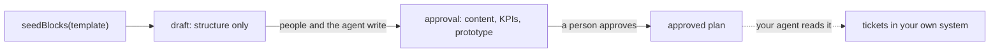

# @re-cinq/planning-document

The plan as JSON, and the rules about it. Zero React, zero Yjs, zero editor: this
is what your API, the planning agent and the browser all agree on.

|               |                                                                                        |
| ------------- | -------------------------------------------------------------------------------------- |
| Runs in       | **Node and the browser**. Its only dependency is zod                                   |
| Installed by  | any service that reads or writes a plan: your API, your web app, an agent, a CLI       |
| Never imports | React, Yjs, BlockNote, Hocuspocus or hapi — so it is safe in every one of those places |

Not sure which package you need? See
[which package does my service install?](../../README.md#which-package-does-my-service-install)

```sh
npm install @re-cinq/planning-document
```

Full guarantees, with the test behind each one: [contract spec](../../specs/planning-document/spec.md).

A plan runs from draft to approval and stops there. Tickets are not part of it:
once a plan is approved, your agent reads it and creates them in your own system.

## Tutorial: teaching your service about plans

The contract alone is enough to create, validate and approve plans. No editor,
no Yjs, no websocket — useful for an API, a CLI, an agent runner or a migration.

### 1. Install

```sh
npm install @re-cinq/planning-document
```

### 2. Decide what a plan of yours is

Pick the kind (`feature`, `ui-change`, `performance`, `refactor`,
`incident-response`) and build the meta your database owns. Workflow state lives
here, not in the content: status, approval, version.

```ts
const meta: PlanMeta = {
  schemaVersion: 1,
  id: crypto.randomUUID(),
  repo: "acme/shop",
  type: "feature",
  templateVersion: 1,
  title: "Faster checkout",
  status: "draft",
  approval: null,
  version: 1,
  createdBy: "ana",
  updatedAt: new Date().toISOString(),
};
```

### 3. Seed it and store it

```ts
const blocks = seedBlocks(templateFor(meta.type), { title: meta.title });
await store.save(meta.id, { meta, blocks });
```

The seed is the feature name as a title block, then a heading and a section
panel per template slot. Store `blocks` as JSON. `planDocumentSchema` and
`blockJsonSchema` parse what comes back, so a bad row fails at the boundary
instead of inside your app.

### 4. Answer "what does this plan say?"

```ts
const plan = toPlanDocument(blocks, meta);
```

`plan.title` is the title block's text, `plan.sections` is what people wrote,
and `kpis` and `prototype` are derived views you can serve, index or put on a
dashboard.

### 5. Gate approval on validation, not on opinion

```ts
const report = validatePlan(plan, "approval");
if (!report.passed) {
  return problem(409, report.problems); // each problem names its slot and why
}
await store.approve(meta.id, { approvedBy: "ana", version: plan.version });
```

Use `"draft"` while writing and `"approval"` before a person signs it off.

### 6. Let the agent write back

```ts
const next = applyOps(blocks, agentOpsSchema.parse(await agentAnswer()));
await store.save(meta.id, { meta, blocks: next });
```

Parse before you apply: `agentOpsSchema` is your guard against a model inventing
a field. Ops are id-stable, so a KPI sent twice is revised, not duplicated.

### 7. Show what changed

```ts
diffPlans(previous.plan, current.plan);
```

When you want the same document edited by several people at once, add
[@re-cinq/planning-yjs](../planning-yjs/README.md) for the live document and
[@re-cinq/planning-sync](../planning-sync/README.md) to host it.

## Scenario: a PM starts a performance plan

A plan begins as its title and the template's sections, nothing else. The
template is data per plan kind (`feature`, `ui-change`, `performance`,
`refactor`, `incident-response`), so a performance plan asks different
questions than a UI change.

```ts
import {
  seedBlocks,
  templateFor,
  toPlanDocument,
  validatePlan,
} from "@re-cinq/planning-document";

const template = templateFor("performance");
const blocks = seedBlocks(template, { title: "Faster search" });
const plan = toPlanDocument(blocks, meta); // meta comes from your database

validatePlan(plan, "draft").passed; // true: structure is fine
validatePlan(plan, "approval").problems;
// [
//   { code: "empty-required-section", slot: "intent", message: '"What we want and why" needs content' },
//   { code: "missing-block", slot: "kpis", message: '"Success criteria" needs at least 1 kpi' },
//   ...
// ]
```

`validatePlan` is the same function the editor's outline shows, the sync library
gates approval with, and your API can answer 409 with. Two phases:



| Phase      | Asks for                                                           |
| ---------- | ------------------------------------------------------------------ |
| `draft`    | the always-required sections exist and hold the right block kinds  |
| `approval` | required sections have real content, KPIs exist, prototype matured |

## Scenario: the KPI gate before approval

KPIs are mandatory, and a UI change additionally needs a prototype of at least
click-dummy maturity. Both are template data, not code:

```ts
templateFor("ui-change").prototypeMinimum; // "click-dummy"
slotFor(templateFor("performance"), "kpis").requires;
// [{ block: "kpi", min: 1 }]
```

## Scenario: the plan document your API answers

`toPlanDocument(blocks, meta)` is the projection everyone reads. `sections` is
lossless (it round-trips through `toBlocks`); `kpis` and `prototype` are derived
and read-only.

```ts
const plan = toPlanDocument(blocks, meta);

plan.title; // "Faster checkout on mobile", from the title block
plan.kpis; // [{ id: "k1", metric: "checkout p95", baseline: "450 ms", target: "200 ms", direction: "down", ... }]
plan.prototype; // { maturity: "click-dummy", url: "https://figma…", agreedBy: "ana", notes: "" }
```

Each section also carries the conversation about it: `question` and `answer`
blocks from the agent and the people answering, and `comment` blocks. They are
allowed in every section and never count as its content.

## Scenario: the planning agent edits the plan

The agent never regenerates a plan. It sends ops keyed by the ids it already
knows, so a KPI is **updated** and keeps its block:

```ts
import { applyOps, agentOpsSchema } from "@re-cinq/planning-document";

const ops = agentOpsSchema.parse(await agentAnswer()); // validate what the model sent

const next = applyOps(blocks, [
  {
    op: "set-section-text",
    slot: "intent",
    paragraphs: ["Checkout feels slow on mobile."],
  },
  {
    op: "upsert-kpi",
    kpi: {
      kpiId: "k-latency",
      metric: "Price step p95 on mobile",
      baseline: "3.2 s",
      target: "400 ms",
      direction: "down",
    },
  },
  { op: "set-prototype", prototype: { maturity: "click-dummy" } },
]);
```

`set-section-text` replaces a section's prose with plain paragraphs and leaves
its plan blocks, questions and comments alone; `append-to-section` adds to it.
`set-section-prose` does the same with rich blocks: paragraphs, level 3
headings, nested bullet, numbered and checklist items, quotes, code with its
language and tables, their text marked bold, italic, code or struck through,
with links. Sending that same `upsert-kpi` again rewrites the KPI and keeps its
block id, which is what keeps other people's cursors from jumping when the
agent writes into a document they are editing.

When the agent edits the plan as a file instead, `planToMarkdown` writes it as
`plan.md` and `markdownToOps` reads the edited file back. Prose is ordinary
Markdown both ways (`**bold**`, `` `code` ``, `- ` lists, `### ` subheadings,
`> ` quotes, fenced code, GFM tables, which read back as the table block), and a
section whose prose changed comes back as one `set-section-prose`.

## Scenario: refining one section while people are still talking

A Refine works from what is settled, and its answer waits for a person:

```ts
import {
  previewProposal,
  refineInputs,
  sectionHash,
  usesOf,
} from "@re-cinq/planning-document";

const inputs = refineInputs(blocks, "scope");
// { answered: [{ questionId: "q-tax", question: "Which markets…?", answer: "Only the EU" }],
//   resolved: [{ commentId: "c1", said: [{ author: "Ben", text: "…" }, …] }],
//   openQuestions: […], openThreads: […] }   ← talk the agent leaves alone

const baseHash = sectionHash(blocks, "scope"); // what the proposal will be checked against
usesOf(inputs); // { questions: ["q-tax"], comments: ["c1"] }

previewProposal(blocks, proposal);
// { lines: [{ kind: "added", text: "Only EU markets …" }], stale: false }
```

The hash covers what a refine would rewrite, not the conversation, so a new
comment does not make a proposal stale and a rewritten paragraph does.
`markUsed(blocks, uses)` flags the questions and threads a proposal used, and
`refineInputs` skips them from then on.

## Scenario: what changed between two versions

```ts
import { diffPlans } from "@re-cinq/planning-document";

const diff = diffPlans(previousVersion, currentVersion);

diff.sections; // only the sections that changed, line by line: kept / added / removed
diff.kpis; // [{ id: "k-latency", kind: "changed" }]
diff.meta; // [{ field: "status", before: "draft", after: "approved" }]
```

## Naming a plan document

One plan, one document name, used by the collaboration socket:

```ts
docName({ repo: "acme/shop", planId }); // "plan:acme/shop:8e3c1f0a-…"
parseDocName(name); // { repo, planId }, or throws DocNameError
```

## Testing helpers

`@re-cinq/planning-document/testing` builds plans for your own tests, so you do
not hand-write block JSON:

```ts
import {
  planMeta,
  planWith,
  readyFeature,
  textBlock,
} from "@re-cinq/planning-document/testing";

const seeded = planWith("feature", {
  kpis: [
    textBlock(
      "kpi",
      { kpiId: "k1", metric: "p95", target: "200 ms" },
      "why it matters",
    ),
  ],
});

const complete = readyFeature(); // passes approval
```
