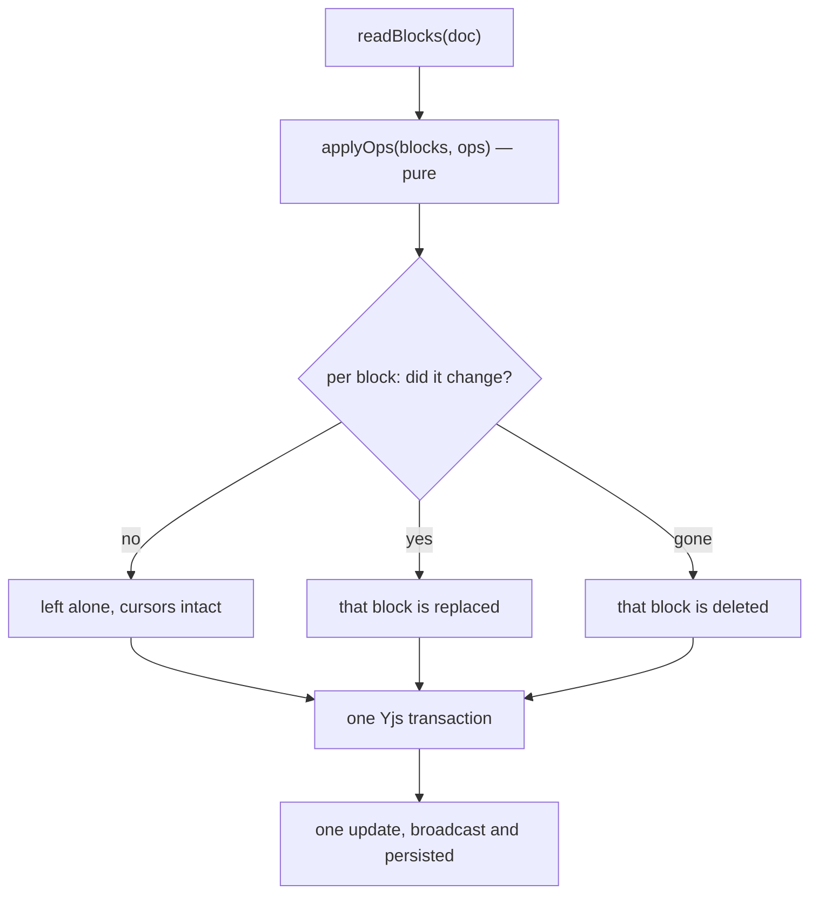

# @re-cinq/planning-yjs

The bridge between a plan's blocks and the Yjs document people edit. It runs in
plain Node — no browser, no DOM, no editor — so a server or an agent can read and
write the same live document a browser is typing into.

```sh
npm install @re-cinq/planning-yjs yjs
```

`yjs` is a peer dependency: one instance per process, always.

|                 |                                                                                              |
| --------------- | -------------------------------------------------------------------------------------------- |
| Runs in         | **Node**, and in browsers (the editor uses it internally)                                    |
| Installed by    | the service that hosts the live document itself, or an agent that edits Yjs outside your API |
| You can skip it | if you use `@re-cinq/planning-sync` or `@re-cinq/planning-editor`: both already depend on it |

Not sure which package you need? See
[which package does my service install?](../../README.md#which-package-does-my-service-install)

Full guarantees, with the test behind each one: [Yjs bridge spec](../../specs/planning-yjs/spec.md).
Why the Yjs document is the truth and the JSON a projection: [ADR-002](../../adrs/ADR-002-yjs-is-truth-json-is-projection.md).

## Tutorial: your own collaboration server

If you host plans with [@re-cinq/planning-sync](../planning-sync/README.md), skip
this — it does all of it for you. This is for a service that wants the live
document on its own terms: a custom socket, a queue, an agent runner.

### 1. Install

```sh
npm install @re-cinq/planning-yjs @re-cinq/planning-document yjs
```

Check that `yjs` resolves to one copy (`npm ls yjs`). Two copies look like
everything works until updates silently stop applying.

### 2. Create the document when the plan is created

```ts
const doc = docFromBlocks(seedBlocks(templateFor("feature")));
await store.saveState(planId, encodeStateAsUpdate(doc));
```

Store the bytes as they are — `bytea`, a blob, a file. They are the plan.

### 3. Keep one document in memory per open plan

A Yjs document is the shared state of everyone editing it, so load it once and
let connections attach to it:

```ts
const open = new Map<string, Doc>();

async function openPlan(planId: string): Promise<Doc> {
  const loaded = open.get(planId);
  if (loaded) return loaded;

  const doc = new Doc();
  applyUpdate(doc, await store.loadState(planId));
  open.set(planId, doc);

  return doc;
}
```

### 4. Wire a socket to it

Send the whole state on connect, then relay every update both ways:

```ts
socket.send(
  JSON.stringify({
    type: "document",
    meta,
    state: toBase64(encodeStateAsUpdate(doc)),
  }),
);

const send = (update: Uint8Array, origin: unknown) => {
  if (origin === socket) return; // do not echo their own edit back
  socket.send(JSON.stringify({ type: "update", update: toBase64(update) }));
};
doc.on("update", send);

socket.on("message", (raw) => {
  const event = JSON.parse(String(raw));
  if (event.type === "update")
    applyUpdate(doc, fromBase64(event.update), socket);
});

socket.on("close", () => doc.off("update", send));
```

That is the same event shape `@re-cinq/planning-editor` speaks, so the editor
can talk to your server with a transport of about twenty lines.

### 5. Persist on a debounce, not on every keystroke

```ts
doc.on("update", () => schedule(planId, 2000));

async function flush(planId: string) {
  const doc = await openPlan(planId);
  const plan = toPlanDocument(readBlocks(doc), await store.meta(planId));
  await store.saveState(planId, encodeStateAsUpdate(doc), plan);
}
```

Storing the projection next to the state is what lets your API answer
`GET /plans/:id` without loading a document at all.

### 6. Let the agent write into the same document

```ts
applyOpsToDoc(await openPlan(planId), ops, "planning-agent");
```

Because it edits the open document, step 4 broadcasts the change to everyone
connected and step 5 persists it. Nothing else to do.

### 7. Check it

Open two sockets on one plan, type through the first, and read the second. Then
restart your service and reconnect: the text is still there, because step 5 ran.

## Scenario: a new plan is created in your API

Seed a document once, store its state, and hand it to the collaboration server.

```ts
import { seedBlocks, templateFor } from "@re-cinq/planning-document";
import { docFromBlocks, SeededDocError } from "@re-cinq/planning-yjs";
import { encodeStateAsUpdate } from "yjs";

const doc = docFromBlocks(seedBlocks(templateFor("feature")));
await store.saveState(planId, encodeStateAsUpdate(doc));
```

Seeding is a one-time act. `seedDoc` on a document that already holds a plan
throws `SeededDocError` instead of duplicating the sections — the JSON is never
written back over a living document.

## Scenario: your API answers "what does this plan say?"

```ts
import { readBlocks } from "@re-cinq/planning-yjs";
import { toPlanDocument } from "@re-cinq/planning-document";
import { applyUpdate, Doc } from "yjs";

const doc = new Doc();
applyUpdate(doc, await store.loadState(planId));

const plan = toPlanDocument(readBlocks(doc), meta);
plan.kpis; // what success means, as the people and the agent wrote it
```

`readBlocks` parses through the contract's schemas, so anything it returns is
valid `BlockJson` — a malformed document fails loudly instead of leaking into
your API.

## Scenario: the planning agent writes while someone is typing

`applyOpsToDoc` applies the contract's ops to a **live** document inside one
transaction, and replaces only the blocks that actually changed. The people in
that document see the agent's words arrive and keep their cursors and selections.



```ts
import { applyOpsToDoc } from "@re-cinq/planning-yjs";

const blocks = applyOpsToDoc(
  doc,
  [
    {
      op: "set-section-text",
      slot: "intent",
      paragraphs: ["Checkout feels slow on mobile."],
    },
    {
      op: "upsert-kpi",
      kpi: {
        kpiId: "k-latency",
        metric: "Price step p95 on mobile",
        target: "400 ms",
      },
    },
  ],
  "planning-agent", // the Yjs transaction origin, so your own handlers can tell
);
```

Inside `@re-cinq/planning-sync` this runs on a Hocuspocus direct connection, so
the change is broadcast and persisted like any other edit. On a bare document
(an agent working offline, a migration) it behaves the same and produces one
update you can ship anywhere.

## Scenario: the agent refines one section

A Refine is asked for while people may still be writing in the section, so the
agent's answer is kept aside as a proposal in the document's `proposals` map,
next to the blocks and outside the plan, until someone accepts it:

```ts
import { acceptRefine, askRefine, proposeRefine } from "@re-cinq/planning-yjs";

const { baseHash } = askRefine(doc, { slot: "scope", askedBy: "Ana" }); // the browser does this

proposeRefine(doc, {
  slot: "scope",
  baseHash,
  ops: [
    {
      op: "append-to-section",
      slot: "scope",
      paragraphs: ["Out: the payment page."],
    },
  ],
  uses: { questions: ["q-tax"], comments: [] },
  proposedBy: "planning-agent",
}); // ProposalScopeError if an op reaches another section

acceptRefine(doc, "scope"); // writes it, marks q-tax used, clears the proposal
```

`acceptRefine` throws `SectionChangedError` when the section's written blocks
changed after the ask; comments and answers added meanwhile do not count as a
change. `discardRefine` drops a proposal, and `proposalsIn(doc)` lists them.

A refine is `asked`, then `proposed` — or `failed`, when the agent could not
answer. `failRefine` turns the ask into a failure that keeps who asked and
carries the reason:

```ts
failRefine(doc, {
  slot: "scope",
  reason: "the agent stopped before it wrote anything",
});
```

It returns what the section holds afterwards. A proposal that already arrived is
kept (a late failure never wipes a real answer), and a section nobody asked
about stays empty. A failed refine has nothing to accept (`NoProposalError`), a
later pass may propose for its section, and `askRefine` simply replaces it.

## Scenario: carrying Yjs over a JSON transport

Updates are bytes; most transports carry text. The wire helpers are the same ones
the editor's `document` and `update` events use:

```ts
import { fromBase64, toBase64 } from "@re-cinq/planning-yjs";

socket.send(JSON.stringify({ type: "update", update: toBase64(update) }));
applyUpdate(doc, fromBase64(event.update));
```

## The headless schema

`headlessPlanSchema` is the BlockNote schema without React: the contract's prose
subset (paragraph, level 2–3 headings, lists, quote, code, table) plus every plan
block (`plan-title`, `section-heading`, `section-panel`, `comment`, `kpi`,
`prototype`, `mockup`, `question`, `answer`).
It is exactly the set the editor registers, which is why a document written in
the browser reads back identically on the server.
