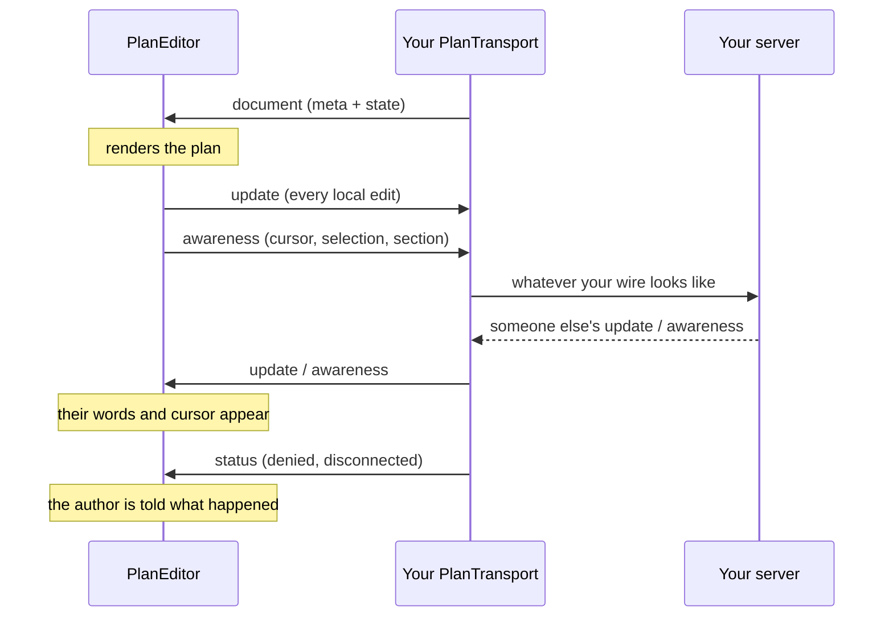
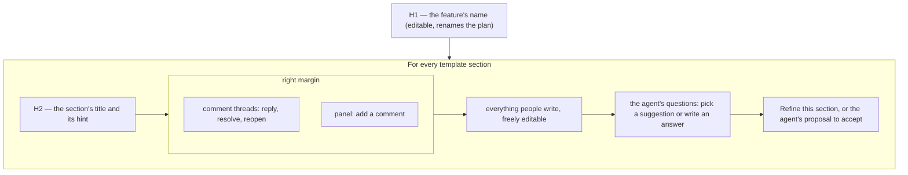

# @re-cinq/planning-editor

The React component people write a plan in: BlockNote over Yjs, with the
template's sections guarded, a slash menu that only offers what the current
section allows, live cursors, a presence bar, and a validation outline.

```sh
npm install @re-cinq/planning-editor react react-dom yjs
```

|               |                                                                                     |
| ------------- | ----------------------------------------------------------------------------------- |
| Runs in       | **the browser**, React 19. It needs the DOM, so keep it out of server rendering     |
| Installed by  | your web app, and nothing else                                                      |
| Talks to      | your server through a `PlanTransport` you supply — usually a WebSocket to your API  |
| Never imports | Hocuspocus's server, hapi or your database: the editor cannot reach the server side |

Not sure which package you need? See
[which package does my service install?](../../README.md#which-package-does-my-service-install)

Full guarantees, with the test behind each one: [editor spec](../../specs/planning-editor/spec.md).

## Tutorial: a plan page in a Next.js app

The example is an App Router page talking to an API that hosts
[@re-cinq/planning-sync](../planning-sync/README.md). Adapt the framework parts;
the editor itself is plain React.

### 1. Install

```sh
npm install @re-cinq/planning-editor @re-cinq/planning-document yjs
```

### 2. Import the stylesheet once

In your root layout, next to your own global styles:

```tsx
import "@re-cinq/planning-editor/style.css";
```

The editor draws from your CSS variables, so your light/dark switch already
drives it.

### 3. Mint a collaboration token server-side

The browser connects straight to your API's WebSocket, so it needs a token, and
a token must never be minted in the browser. A route handler that checks the
session and the user's access to the repo:

```ts
// app/api/plans/[id]/collab-token/route.ts
export async function POST(request: Request, { params }: Params) {
  const session = await getServerSession(authOptions);
  if (!session)
    return Response.json({ error: "unauthorized" }, { status: 401 });
  if (!(await userCanAccessRepo(session, params.id)))
    return Response.json({ error: "forbidden" }, { status: 403 });

  return Response.json({
    token: await mintCollabToken(session, params.id), // 10 minutes is plenty
    wsUrl: process.env.PLANNING_WS_URL, // wss://api.example/api/plans/collab
    documentName: `plan:${repo}:${params.id}`,
  });
}
```

Returning `wsUrl` from the server keeps it out of your client bundle, which
matters if you build one image per environment.

### 4. Render the editor in a client component

BlockNote needs the DOM, so keep it out of server rendering:

```tsx
// app/repos/[owner]/[repo]/plans/[id]/PlanPage.tsx
"use client";

import { useEffect, useState } from "react";
import { PlanEditor, type ProviderTransport } from "@re-cinq/planning-editor";
import { createHocuspocusTransport } from "@re-cinq/planning-editor/transports/hocuspocus";

export function PlanPage({ plan, user }: PlanPageProps) {
  const [transport, setTransport] = useState<ProviderTransport | null>(null);

  useEffect(() => {
    let closed = false;
    let own: ProviderTransport | undefined;

    void fetchCollabToken(plan.id).then((session) => {
      if (closed) return;
      own = createHocuspocusTransport({
        url: session.wsUrl,
        name: session.documentName,
        meta: plan,
        token: session.token,
      });
      setTransport(own);
    });

    return () => {
      closed = true;
      own?.destroy();
    };
  }, [plan]);

  if (!transport) return <p>Connecting…</p>;

  return (
    <PlanEditor
      transport={transport}
      user={user}
      validationPhase="approval"
      onValidation={(report) => setCanApprove(report.passed)}
    />
  );
}
```

Import it with `dynamic(() => import("./PlanPage"), { ssr: false })` from the
server component that fetched the plan.

### 5. Give each person a colour

`user.color` is what their cursor and their entry in the presence bar are drawn
in. Derive it from the user id so it is stable between sessions.

### 6. Check it with two browsers

Open the page in a normal window and a private one, signed in as two people.
Type in one: the words, the cursor and the presence entry appear in the other.
If nothing arrives, look for a `status` event of `denied` — that is your
authenticator refusing the token, not the editor.

### 7. Keep your page tests in jsdom

Your tests should not need a browser to render a page that happens to contain an
editor:

```tsx
import { PlanEditorStub } from "@re-cinq/planning-editor/testing";

vi.mock("./PlanPage", () => ({ PlanPage: PlanEditorStub }));
```

The stub renders a plan's sections and text statically, with the same props
shape (`meta`, `initialBlocks`), so the page around it is what gets tested.

## Scenario: the plan page in your app

The editor knows nothing about your network. You hand it a `PlanTransport`; the
whole plan arrives as one `document` event.

```tsx
import { PlanEditor } from "@re-cinq/planning-editor";
import { createHocuspocusTransport } from "@re-cinq/planning-editor/transports/hocuspocus";
import "@re-cinq/planning-editor/style.css";

const transport = createHocuspocusTransport({
  url: "wss://api.example/api/plans/collab",
  name: documentName, // "plan:acme/shop:<uuid>"
  meta, // the plan meta your page already fetched
  token: () => fetchCollabToken(planId), // short-lived, minted by your BFF
});

<PlanEditor
  transport={transport}
  user={{ id: session.user.id, name: session.user.name, color: "#d33682" }}
  onChange={(plan) => setPlan(plan)}
  validationPhase="approval"
  onValidation={(report) => setCanApprove(report.passed)}
/>;
```

Call `transport.destroy()` when the page unmounts; that closes the socket.

## Scenario: your own socket instead of Hocuspocus

`PlanTransport` is two functions. Anything that can carry JSON can be one:

```ts
import type { PlanTransport } from "@re-cinq/planning-editor";

const transport: PlanTransport = {
  send: (event) => socket.send(JSON.stringify(event)), // "update" | "awareness"
  subscribe: (handler) => {
    const listen = (message: MessageEvent) => handler(JSON.parse(message.data));
    socket.addEventListener("message", listen);

    return () => socket.removeEventListener("message", listen);
  },
};
```

Inbound events: `document` (plan meta plus the base64 Yjs state — send this
first, and again after a reconnect), `update`, `awareness`, `meta`, `status`.
Outbound: `update` and `awareness`, sent as they happen.



## What a plan looks like



The title and every heading and panel are fixed by the template: they cannot be
deleted, duplicated or moved, and nothing can be written between the title and
the first section. In the document a section is its heading, then its comments
and its panel, which float into the margin beside the text, then the content.
Everything in the content is ordinary, collaborative text.

## Scenario: refining one section with your agent

Refine is a callback, so the agent, the model and the cost stay yours. People
may still be writing and talking in the section when someone presses it, so a
refine never writes straight in:

1. **It works from what is settled.** The button is enabled once the section
   has an answered question or a resolved thread, and says what it will use
   ("uses 2 answers, 1 resolved thread"). Open questions and threads go to the
   agent as talk to leave alone.
2. **Everyone sees it asked.** The ask lands in the shared document, so every
   tab shows "The agent is refining this for Ana…" until the answer arrives. A
   rejected `onRefine` promise withdraws it.
3. **The agent proposes.** Your agent posts ops for that one section to
   `/proposals`. The section shows them as added and removed lines, with Accept
   and Discard, to everyone.
4. **Accepting checks the section.** If nobody changed the section since the
   ask, Accept writes the proposal and marks the questions and threads it used,
   which then read "in the plan" and no longer count. If someone did, the
   proposal can only be asked for again.

```tsx
<PlanEditor
  transport={transport}
  user={user}
  onRefine={async ({ slot, title, inputs, uses, baseHash }) => {
    // inputs: { answered, resolved, openQuestions, openThreads }
    const ops = await myAgent.refine({ title, slot, inputs }); // your model, your prompt
    await fetch(`/api/plans/${planId}/proposals`, {
      method: "POST",
      headers: { "content-type": "application/json" },
      body: JSON.stringify({
        actor: "planning-agent",
        slot,
        baseHash,
        ops,
        uses,
      }),
    });
  }}
/>
```

Leave `onRefine` out and no Refine button is shown. The agent can also ask
instead of write: a `question` block with `options` (comma-separated) renders
its suggested answers as buttons, one without options takes a written answer,
and either way an `answer` block goes under it.

## Scenario: two people in one plan

Nothing to configure. Every local edit goes out immediately, remote cursors are
drawn in their owner's colour with their name, and the participants list at the
top of the sidebar, above the outline, names everyone else with the section they
are in ("Ana in Success criteria"). A participant whose cursor is in the
document is a button: clicking it scrolls their cursor into view. One who has
not placed a cursor yet is listed but not clickable. Pass `showPresence={false}`
to hide the list; the cursors stay.

## Scenario: a preview, a version view, or a test without a server

`createMemoryHub` is an in-process hub. Two editors on one hub collaborate with
each other; one editor on its own is simply an offline plan.

```tsx
import { localTransport } from "@re-cinq/planning-editor";

<PlanEditor
  transport={localTransport({ meta, blocks })}
  user={{ id: "preview", name: "Preview", color: "#268bd2" }}
  readOnly
  showOutline={false}
/>;
```

## Scenario: rendering a mockup safely

The editor never injects a mockup's markup. It asks your host to render it, so
the sandboxing policy stays yours:

```tsx
<PlanEditor
  transport={transport}
  user={user}
  adapters={{
    renderMockup: ({ format, markup, height }) => (
      <SandboxedFrame format={format} markup={markup} height={height} />
    ),
  }}
/>
```

## Scenario: showing what a version changed

```tsx
import { PlanDiffView } from "@re-cinq/planning-editor";

<PlanDiffView before={previousVersion.json} after={currentVersion.json} />;
```

Sections that nobody touched are left out; added and removed lines are marked,
and KPIs are listed as added, changed or removed.

## Scenario: your page tests, without a browser

Browser-mode tests are the editor's business, not yours. For jsdom page tests,
render the static stub:

```tsx
import { PlanEditorStub } from "@re-cinq/planning-editor/testing";

<PlanEditorStub meta={meta} initialBlocks={blocks} />;
```

## Theming

Import `@re-cinq/planning-editor/style.css` once and the editor takes your
theme. The styles are SCSS modules compiled into that one file; nothing is
inlined in the components, and no colour, size or radius is hard-coded outside
the token layer.

Every value the editor draws with is a `--ps-*` token that reads **your** design
token first and falls back to a neutral default, so the editor works with no
tokens at all and follows your theme the moment they exist:

| The editor reads                 | From your token                                                                               |
| -------------------------------- | --------------------------------------------------------------------------------------------- |
| text, muted text, text on accent | `--text`, `--text-muted`, `--text-on-accent`                                                  |
| surfaces                         | `--bg`, `--bg-surface`, `--bg-elevated`, `--bg-hover`                                         |
| lines and focus                  | `--border`, `--border-hover`, `--focus-ring`                                                  |
| accent and states                | `--accent`, `--accent-hover`, `--success`, `--warning`, `--danger`                            |
| type                             | `--font-sans`, `--font-mono`, `--fs-xs`, `--fs-sm`, `--fs-lg`, `--fw-semibold`                |
| rhythm and shape                 | `--space-2`, `--space-3`, `--space-5`, `--space-6`, `--radius-sm`, `--shadow`, `--transition` |

BlockNote's own `--bn-*` variables are all derived from those tokens, so a theme
switch needs no work on your side: change your tokens (or flip
`data-color-scheme="dark"` on the document) and the editor changes with them,
including native form controls, because it sets `color-scheme` to match.

Two ways to tune it without forking:

```css
/* 1. give the editor different values than the rest of your app */
.ps-editor {
  --ps-fs-section: var(--fs-xl);
  --ps-accent: var(--brand-purple);
}

/* 2. theme the standalone diff too; it carries the same tokens */
.ps-diff {
  --ps-font-mono: var(--font-code);
}
```

Both roots (`.ps-editor`, `.ps-diff`) declare the whole token set, so the diff
view is themed even on a page with no editor on it.

## What the editor refuses to do

- Delete, duplicate or reorder the title, a section heading or a section's
  panel: the template's shape is fixed. Your own code can still do it by marking
  the transaction with `bypassTemplate`.
- Put a block between the title and the first heading, which would leave it in
  no section.
- Offer a block a section does not allow.
